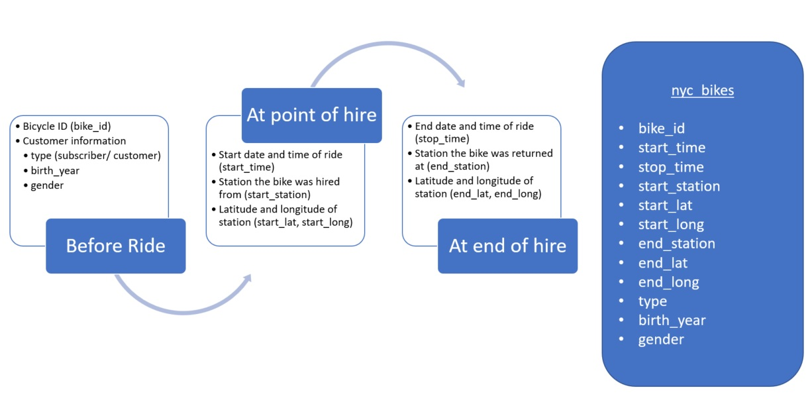

# 1. Documentation

## Domain knowledge

Citi Bike is a bicycle sharing system in New York City and currently the largest cycle sharing network in the United states. These public transportation systems are popular in urban areas and offer shared use bicycles that individuals can rent for short periods of time (Midgley, 2011). Since the bicycles are maintained by the rental company, this makes them an attractive option for people who want access to bicycles without the costs and responsibilities of owning a bicycle.

The Citi Bike program was launched in 2013 and now incorporates 20,000 bicycles, which can be rented at over 1,300 stations across the New York city metropolitan area. They can be hired at one self-serve bike station and returned at another, which makes them ideal for one-way trips in places like New York City where parking is often difficult and expensive. Additionally, cycling takes away the hassle of waiting for buses and trains and any transfers needed to get to the final destination.

Citi Bike offers both an annual subscription for frequent users as well as the option to buy a short-term pass through the app for visitors to the city. It is a healthy and affordable way to commute to work or explore the city.

## Business requirements

This report aims to explore and better understand patterns in bike hires in order to make recommendations to increase bike hires and identify any potential gaps in the market or potential challenges that need to be taken into account.

The first step is to find patterns that are of interest in the business brief. These are:
  - Patterns over time (e.g. across the year, month, week, time of the day)
  - Patterns across different demographics (e.g. gender, age, type of trip)
  - Geographical patterns in usage
  
These patterns will be explored by looking at counts (e.g. number of bike hires) and averages (e.g. mean/median trip durations) for the variables of interest above. These will be visually represented using appropriate visualisations. The visualisations will be interpreted and any implications for the business will be discussed.

## Business processes and data flow

The graphic below shows the process by which data was collected to construct the nyc_bikes dataset.

```{r}

```

## Data visualisation as a tool for decision-making

This report will be useful for Citi Bikes because identifying patterns in usage can help to make better business decisions. This could include: identifying areas where market research is needed to increase use, finding the best days/times to maintain the bikes, appropriately allocating bikes (e.g. to the most popular stations/at the most used times), and targeting advertising appropriately.

Identifying patterns over time can help to identify potential dips in the usage of the bikes. For example, if there is a season where usage tends to drop, market research into why customers aren't using the bikes during this season could help to increase use. Low usage seasons are also ideal for necessary longer scheduled maintenance on the bike fleet.

Additionally, understanding which days and times have low usage is invaluable in making decisions about what days and times are best for routine bike maintenance (e.g. pumping up tyres, safety checks) as we don't want bikes to be unavailable on days/times where bikes are in high demand.

Understanding the patterns in usage by different demographics could help to identify groups we aren't reaching and who might be targeted better through more appropriate advertising.

Investigating geographical patterns of usage could help to understand which stations are most frequently used, which is useful in appropriately allocating bikes to ensure that frequently used stations have enough bikes to keep up with demand.


## Data types

The dataset contains data from 10 bikes used almost exclusively in Jersey City. It is made up of the following variables:

1) bike_id <br>
    -unique number for each hire bike <br>
    -numeric (factor)
2) start_time <br>
    -time the bike hire started <br>
    -datetime
3) stop_time <br>
    -time the bike hire ended <br>
    -datetime
4) start_station <br>
    -unique number for the bike hire station the bike hire started from <br>
    -numeric (factor)
5) start_lat <br>
    -latitude for start station <br>
    -numeric
6) start_long <br>
    -longitude for start station <br>
    -numeric
7) end_station <br>
    -unique number for the bike hire station the bike hire ended at <br>
    -numeric (factor)
8) end_lat <br>
    -latitude for end station <br>
    -numeric
9) end_long <br>
    -longitude for end station <br>
    -numeric
10) type <br>
    -type of user hiring the bike - subscriber (annual pass holder), customer (short-term pass holder) <br>
    -character
11) birth_year <br>
    -customer's birth year <br>
    -numeric
12) gender <br>
    -customer's biological sex (male, female,             unknown) <br>
    -character (factor)
    
## Data quality and data bias

This is a biased dataset. It only contains data from a small subset of bikes (n = 10) and, more importantly, was limited to only data about journeys starting from and (for the most part) ending in Jersey City. 

This is a concern when making recommendations because recommendations based on data from the Jersey City context might not be transferrable to other boroughs that Citi Bike serves.

Jersey City is a fairly self-contained community as pertains to bike hire. The only way to cycle into the city (and potentially return the bike in Manhattan) would be to take the bike on a ferry. The tunnels that go between Jersey City and Manhattan are not accessible to bikes.

The bike usage patterns in Jersey City will likely be substantially different than areas like Manhattan where there is likely to be more bike use for tourism. Therefore, the busier days and times could be different for this area. We may also see differences in user profiles as short-term pass holders might be more prevalent in places where tourists are more likely to visit. Additionally, commuting from Brooklyn, Queens or the Bronx into Manhattan (or between those boroughs) does not require use of a ferry and we may see longer commuting journeys and bike returns across borough boundaries. 


In this case, it is very important to understand the limitations of this dataset and to stress that the findings and recommendations should not be taken out of context and applied to other more connected boroughs in NYC. Doing this could have negative implications for users in other service areas. Instead, our next steps should be to collect data about these areas so that we can make appropriate recommendations for them.

# 2. Data cleaning
Preparing data for visualisation

## 2.1 Dealing with missing values and mis-formatted variables

The first step in preparing the data for visualisation was to explore the dataset to see if there were any missing values and mistakenly formatted variables. I found that there was no missing data and the variables were all formatted correctly (e.g. no numeric variables that were mistakently formatted as character variables).

## 2.2 Create additional variables needed for visualisation

The following variables were created for the analysis:

### From start_time

- start_date - extracted date from datetime variable <br>
- start_month - extracted month <br>
- start_year - extracted year <br>
- start_wday - extracted day of the week <br>
- start_time_clock - extracted time from datetime variable <br>
- start_time_hour - extracted hour of from start_time_clock <br>

### From birth_year

- age - customer age created by subtracting birth_year from start_year

### Ride duration

- use_period - difference between start and stop time <br>
- use_duration_minutes - use_period in minutes for better comparison

## 2.3 Fix problems identified in dataset

- I identified very high values in the variable use_duration_mins and imputed them with the median for subscribers

There are two very high values that show use_duration_mins as over 5000. After looking at the lat/long for the start and end stations, they are fairly close together. It is likely that these long use periods are the result of returning the bikes incorrectly (the website states that you have to wait for the green light). So if the bikes weren't returned correctly, the stop_time wouldn't be recorded until someone (e.g. another customer or someone who maintains the bikes for the company) returned it correctly. Since there are some high values in the dataset that will pull the mean higher, I have chosen to impute them with the median duration for the subscribers group (since both are subscribers).

- I identified two very high ages - 131 and 130 - potentially caused by typos in birth_year.

Upon examination, this error was caused because customers had entered their birth year in the 1800s. I decided to impute the birth years by changing the 18xx to 19xx as this is the most likely typo that the customer would have made. 


# 3. Data visualisation