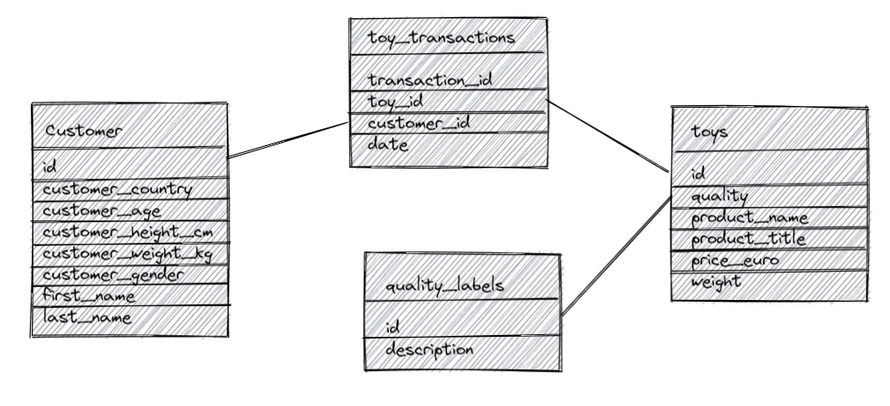

# Libraries
```{r}
library(tidyverse)
library(janitor)
library(lubridate)
library(fs)
```

# 1. Load in the transaction data and create a column date from the day, month and year columns.

```{r}
#3.7 Data loading
toy_transactions <- read_csv("raw_data/toy_transactions.csv") %>% clean_names()
```

```{r}
#3.4 String manipulation including extracting a substring, replacing part of a string, joining strings and splitting strings
#3.2 Types of data transformation
#unite columns and then transform into date type variable
toy_transactions <- toy_transactions %>% 
  unite("date", day:year, sep = "-") %>% 
  mutate(date = dmy(date))
```

# 2. Load in the toys data
```{r}
toys <- read_csv("raw_data/toys.csv") %>% clean_names()
```

## 2.1 Convert the weight column to numeric.

```{r}
#3.2 Types of data transformation
#3.4 String manipulation including extracting a substring, replacing part of a string, joining strings and splitting strings
#3.5 Data cleaning
toys <- toys %>% 
  mutate(weight = as.numeric(str_extract(weight, "[:digit:]+.[:digit:]+")))
```

## 2.2 Split the extra information from the product into a new column, so you have two columns: product_name and product_title. Make sure you don’t have any extra whitespace in either column.

```{r}
#3.4 String manipulation including extracting a substring, replacing part of a string, joining strings and splitting strings
#3.5 Data cleaning
toys <- toys %>% 
  separate(product, sep = " - ", into = c("product_name", "product_title"))
```


# 3. Load in the dataset on quality labels:

```{r}
#3.5 Data cleaning
#3.7 Data loading

quality_labels <- read_csv("raw_data/quality.csv") %>% clean_names()
```

## 3.1 Remove the unnecessary information for each descriptor

```{r}
#3.4 String manipulation including extracting a substring, replacing part of a string, joining strings and splitting strings

quality_labels <- quality_labels %>% 
  mutate(description = str_remove(description, "Quality: "))
```

## 3.2 Replace the categories so ‘Awesome’ and ‘Very Awesome’ become ‘Good’ and ‘Very Good’. Do the same thing for ‘Awful’ replacing it with ‘Bad’.

```{r}
#3.5 Data cleaning

quality_labels <- quality_labels %>% 
  mutate(description = case_when(
    description == "Awesome" ~ "Good",
    description == "Very Awesome" ~ "Very Good",
    description == "Awful" ~ "Bad",
    description == "Very Awful" ~ "Very Bad",
    TRUE ~ description
  ))
```

# 4. Using the steps above, create a dataframe called customers which contains data on customers from all countries by reading in and binding all customer datasets in one pipeline.

```{r}
#3.1 Tools for data transformation including tools for automating data transformation

data_dir <- "raw_data"

customer_files <- fs::dir_ls(data_dir, regexp = "\\_customers.csv")

customer <- customer_files %>% map_dfr(read_csv)
```

# 5. Impute missing values in numeric columns with the median value of customers with the same gender and country. For example, a customer whose gender is female and whose country is Australia with a missing age should get the median age of all Australian females in the dataset.

```{r}
#3.1 Tools for data transformation including tools for automating data transformation

customer <- customer %>% 
  group_by(customer_country, customer_gender) %>% 
  mutate(across(where(is.double), ~coalesce(.x, median(.x, na.rm = TRUE))))
```

# 6. Create a star schema 

```{r}
#3.6 Data modelling including star schema


```


# 7. Join your four cleaned datasets together and call the joined dataset toys_joined. This join should keep all observations from all tables.

```{r}
#3.3 Transformations including joins

toys_joined <- toy_transactions %>% 
  full_join(customer, by = c("customer_id" = "id")) %>% 
  full_join(toys, by = c("toy_id" = "id")) %>% 
  full_join(quality_labels, by = c("quality" = "id"))
```

# 8. Are there any ethical and legal considerations with storing this data in its current state?

3.8 Legal and ethical considerations for data storage

There are both ethical and legal considerations here. From an ethics perspective, you should only gather data that you need for your analysis and not gather data for the sake of gathering data. There is no real reason for us to have information about a customer's height and weight and this data wouldn't add anything to potential analyses. 

From a legal perspective, customer height and weight would be considered special category data because they are considered data about a person's health. It is likely that we would not meet the conditions for processing special category data under Article 9 of the UK GDPR.

# 9. Remove any personally identifiable or sensitive information on customers.

```{r}
#1.8 Data management including security
toys_joined <- toys_joined %>% 
  select(-c(customer_height_cm,customer_weight_kg))
```

# 10. Write your new joined dataset (which does not contain personal/sensitive information) to a csv file.

```{r}
write_csv(toys_joined, "clean_data/toys_joined.csv")
```

#11. Use a .gitignore file to make sure the raw data on customers which still contains personal/sensitive information is not pushed up to your PDA GitHub.